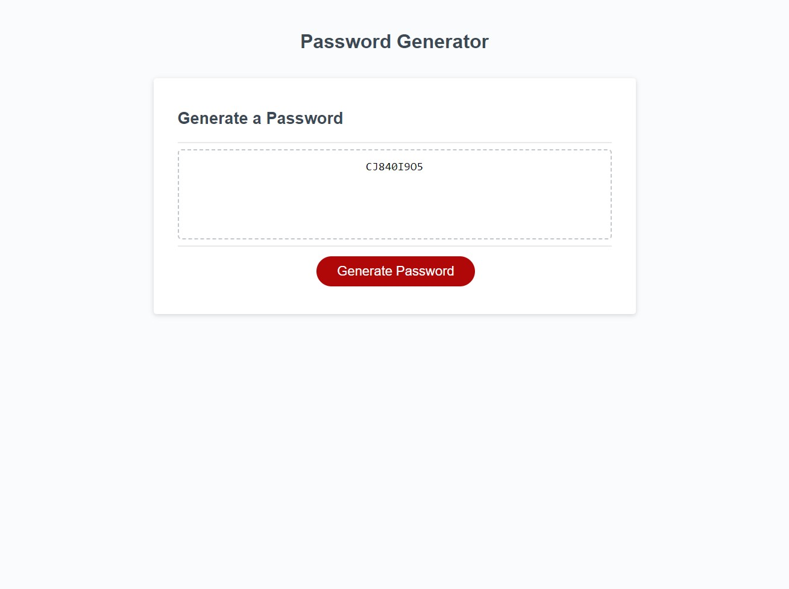

# Password Generator

## Description

This project is a password generator designed to let a user pick certain aspects they would like to include in their password.
Those aspects are:
- Password length
- If they want to include lowercase characters
- If they want to include uppercase characters
- If they want to include numeric characters
- If they want to include special characters
There is validation to ensure that a user:
- Inputed a length no less than 8 and no greater than 128
- Explicitly wrote "yes" or "no" (not case sensitive)
- Chose at least one character type

This project was almost solely a practice in JavaScript. It includes:
- functions
- if statements
- for loops
- Math functions (.floor and .random)
- indexing

## Installation

N/A

## Usage

Webpage: https://ctalv.github.io/password_generator/

## Credits

N/A

## License

MIT License

## Tests

Future section!

# Module_3_Challenge